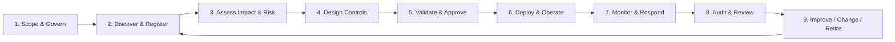
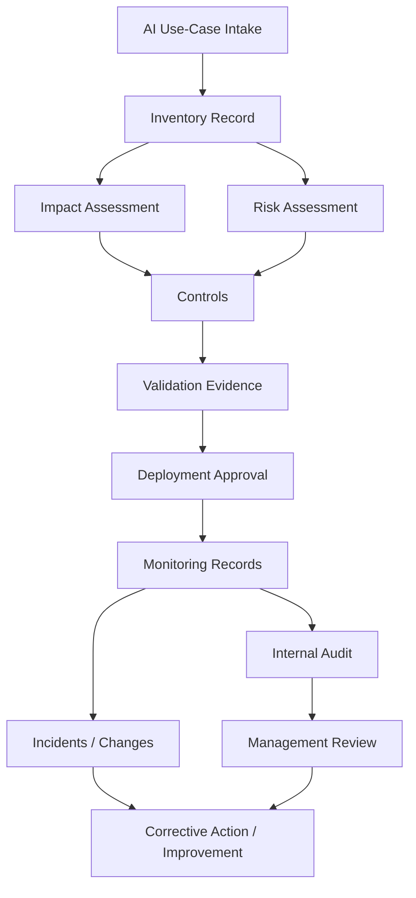

# AIMS Implementation Map

This page connects the repository's artifacts into one practical operating model.

> The mapping below is an original implementation aid. It is deliberately not a reproduction of ISO/IEC 42001 clauses or Annex A text. Use the official standard for normative requirements.

## End-to-end lifecycle

## Practical mapping

| Stage | Key question | Main artifacts | Artifact type | Typical output/evidence |
|---|---|---|---|---|
| Scope & govern | What is in scope and who is accountable? | `01-context-and-scope/`, `02-leadership-and-governance/` | Templates / registers | Approved scope, policy, governance roles |
| Discover & register | What AI systems do we use? | `03-ai-inventory/` | Register / intake template | Current inventory, ownership, intended use |
| Assess impact | Who can be affected and how? | `05-ai-impact-assessment/` | Assessment templates | Affected parties, harms, oversight needs |
| Assess risk | What can go wrong and how serious is it? | `04-risk-management/` | Methodology / registers / templates | Risk rating, treatments, residual risk |
| Govern data | Is the data appropriate for the intended use? | `06-data-governance/` | Checklists / assessments | Data-quality, privacy, bias review evidence |
| Govern suppliers | What are we relying on externally? | `08-third-party-ai/` | Assessments / checklist | Vendor due diligence, contractual controls |
| Validate & approve | Is the system ready to be used? | `07-ai-lifecycle/` | Checklists / approval record | Validation evidence, approval decision |
| Implement controls | Which controls address each risk? | `11-controls/` | Control matrix | Control owner, implementation, evidence |
| Monitor | Is it still behaving acceptably? | `09-monitoring/` | Framework / register / review | Metrics, incidents, drift, overrides, actions |
| Assure & improve | Is the AIMS operating effectively? | `10-audit-and-assurance/` | Registers / audit / review | Findings, nonconformities, management actions |
| Learn from example | How does this work end to end? | `12-case-study/loan-underwriting-ai/` | Example | Populated illustrative use case |

## Minimum viable governance path for one use case

A team adopting this framework for one AI system can begin with nine decisions:

1. **Intended use** — document why AI is being used and what it must not be used for.
2. **Ownership** — identify the business owner, system owner, and required control functions.
3. **Affected parties** — identify direct and indirect stakeholders.
4. **Impact** — identify plausible harms and benefits.
5. **Risk** — assess likelihood/severity using an approved method.
6. **Controls** — decide what must be prevented, detected, reviewed, logged, or escalated.
7. **Approval** — document readiness and residual-risk acceptance.
8. **Monitoring** — define what will be measured and what triggers intervention.
9. **Change** — reassess when the model, data, vendor, use case, regulation, or operating environment materially changes.

## Evidence chain

A management system becomes credible when decisions leave an evidence trail:

## Template vs evidence

A blank template is **not evidence that a control operated**.

For example:

- Blank `deployment-approval.md` = **Template**
- Completed and approved deployment decision = **Evidence**
- `evidence-register.csv` = **Register** that points to retained evidence
- `12-case-study/...` = **Example**, not evidence for a real organization

This distinction matters because strong governance is about demonstrable operation, not document volume.

## How to tailor the toolkit

Keep the overall management-system logic, but tailor:

- risk tiers and thresholds;
- role names and approval authority;
- assessment depth;
- validation criteria;
- monitoring frequency;
- evidence retention;
- supplier due diligence;
- legal/regulatory mappings;
- integration with existing enterprise processes.

The framework should fit the organization's actual AI risk profile rather than forcing every AI use case through identical controls.
