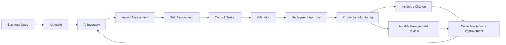

# ISO/IEC 42001 AI Management System Framework

**A practical, reusable AI Management System (AIMS) implementation toolkit inspired by ISO/IEC 42001:2023.**

Use it to move from **“we need AI governance”** to a repeatable operating model for AI intake, inventory, impact and risk assessment, lifecycle approval, supplier governance, monitoring, evidence, audit, and continual improvement.

> **Important:** This is an independent educational and implementation project. It does not reproduce ISO/IEC 42001, is not an official ISO publication, and does not represent certification, legal advice, or a guarantee of conformity. Obtain the official standard for authoritative requirements.

## Start here

**New to the repository? → Read [`START-HERE.md`](START-HERE.md)**

Then choose what you need:

| I want to... | Go here |
|---|---|
| Understand how all artifacts connect | [`IMPLEMENTATION-MAP.md`](IMPLEMENTATION-MAP.md) |
| Build a baseline AIMS | [`90-DAY-IMPLEMENTATION-ROADMAP.md`](90-DAY-IMPLEMENTATION-ROADMAP.md) |
| Find the right template/register/checklist | [`ARTIFACT-CATALOG.md`](ARTIFACT-CATALOG.md) |
| See an end-to-end worked example | [`12-case-study/loan-underwriting-ai/`](12-case-study/loan-underwriting-ai/) |
| Check public-facing ISO facts and project boundaries | [`FACT_CHECK.md`](FACT_CHECK.md) |

## Who this repository is for

- AI governance and Responsible AI teams
- CIO/CTO and technology-governance functions
- Enterprise and solution architects
- AI/ML engineering and platform teams
- Risk, model-risk, compliance, privacy, and security professionals
- Internal audit and assurance teams
- Product and business owners deploying AI
- Procurement and third-party-risk teams evaluating AI suppliers
- Students and practitioners learning how AI governance works operationally

## What you can do with it

You can use this repository as a starting point to:

1. define the scope of an AIMS;
2. establish AI policy, roles, and governance forums;
3. build and maintain an AI system inventory;
4. intake and triage new AI use cases;
5. assess affected parties, impacts, and AI risks;
6. review data quality, privacy, bias, and human oversight;
7. introduce lifecycle design, validation, deployment, change, and retirement gates;
8. assess third-party AI and contractual controls;
9. define production monitoring and incident management;
10. map risks to controls, owners, and evidence;
11. perform internal assurance and management review; and
12. create a continual-improvement backlog.

## The operating model

## Eight governance questions for every AI system

This repository uses an original eight-question implementation heuristic:

1. **Who is affected?**
2. **What harm could occur?**
3. **What data is being used?**
4. **Is there bias?**
5. **Is the decision explainable?**
6. **Is human review required?**
7. **Who signs off?**
8. **What monitoring happens after deployment?**

The questions are intentionally simple. The supporting artifacts turn them into evidence, ownership, controls, and lifecycle decisions.

## Repository map

| Area | What it helps you do | Main artifact types |
|---|---|---|
| `01-context-and-scope` | Define AIMS boundaries and interested parties | Templates / register |
| `02-leadership-and-governance` | Establish policy, accountability, decision rights | Templates |
| `03-ai-inventory` | Discover, register, and intake AI systems | Register / template |
| `04-risk-management` | Identify, score, treat, and track AI risk | Methodology / templates / register |
| `05-ai-impact-assessment` | Assess people, groups, impacts, and oversight | Templates |
| `06-data-governance` | Review data quality, privacy, and bias | Checklists / assessments |
| `07-ai-lifecycle` | Design, validate, approve, and retire systems | Checklists / approvals |
| `08-third-party-ai` | Evaluate AI suppliers and contracts | Assessments / checklist |
| `09-monitoring` | Monitor behavior, performance, incidents, and changes | Framework / register / review |
| `10-audit-and-assurance` | Collect evidence, audit, review, and correct gaps | Registers / checklists / review |
| `11-controls` | Connect risks to controls, owners, and evidence | Control matrix |
| `12-case-study` | See the framework applied to a hypothetical lending use case | Worked example |
| `diagrams` | Visualize governance and lifecycle flows | Mermaid diagrams |

## How a real use case moves through the toolkit

For a single AI system, the practical sequence is:

**Intake → Register → Assess impact → Assess risk → Select controls → Validate → Approve → Deploy → Monitor → Reassess/change/retire**

The minimum recommended artifact path is:

1. `03-ai-inventory/ai-use-case-intake.md`
2. `03-ai-inventory/ai-system-register.csv`
3. `05-ai-impact-assessment/ai-impact-assessment.md`
4. `04-risk-management/ai-risk-assessment-template.md`
5. `11-controls/control-implementation-matrix.csv`
6. `07-ai-lifecycle/validation-checklist.md`
7. `07-ai-lifecycle/deployment-approval.md`
8. `09-monitoring/model-monitoring-framework.md`
9. `09-monitoring/post-deployment-review.md`

See [`IMPLEMENTATION-MAP.md`](IMPLEMENTATION-MAP.md) for the complete evidence chain.

## Template ≠ evidence

One of the most important ideas in this repository is the distinction between an artifact and proof that governance actually operated.

| What you have | What it means |
|---|---|
| Blank risk assessment | A **template** exists |
| Completed risk assessment | An **assessment record** exists |
| Approved assessment with owner/date | There is **governance evidence** |
| Risk linked to implemented control | There is **traceability** |
| Control tested and reviewed over time | There is evidence of **operation and assurance** |

A mature AIMS is not a folder full of documents. It is a management system that produces traceable decisions and evidence over time.

## 90-day adoption path

A suggested baseline rollout is included in [`90-DAY-IMPLEMENTATION-ROADMAP.md`](90-DAY-IMPLEMENTATION-ROADMAP.md):

**Days 1–30 — Establish**  
Scope, sponsorship, policy, roles, inventory, risk method.

**Days 31–60 — Operationalize**  
Impact/risk assessments, data controls, lifecycle gates, supplier governance, control mapping.

**Days 61–90 — Operate and improve**  
Monitoring, incidents, evidence, internal assurance, management review, corrective actions.

This is an illustrative implementation roadmap, **not a 90-day certification promise**.

## Featured case study

[`12-case-study/loan-underwriting-ai/`](12-case-study/loan-underwriting-ai/) applies the framework to a **hypothetical AI-assisted loan-underwriting system**.

It demonstrates how to connect:

**system description → affected parties → impact assessment → risk assessment → controls → monitoring**

The case study is intentionally illustrative and should not be treated as evidence for a real organization.

## AIMS and continual improvement

The repository follows a practical management-system loop:

AI governance should therefore continue after deployment. Material changes to the model, data, supplier, intended use, affected population, legal environment, or system behavior may require reassessment.

## What this repository demonstrates professionally

For portfolio purposes, the project demonstrates the ability to translate AI governance principles into an operational enterprise framework spanning:

- AI governance and Responsible AI
- AI risk and impact assessment
- technology governance
- enterprise architecture
- model/system oversight
- data governance
- privacy and security interfaces
- third-party AI risk
- control design and traceability
- production monitoring
- audit readiness and continual improvement
- financial-services AI governance through the worked case study

## Use and adaptation

You are welcome to adapt the original repository content under the included MIT License. Before operational use, tailor it to your organization’s actual:

- business model and AI use cases;
- risk appetite and materiality thresholds;
- jurisdictions and regulatory obligations;
- existing risk, security, privacy, procurement, model-risk, quality, and audit frameworks;
- technology architecture and AI platform;
- governance roles and approval authorities; and
- evidence-retention practices.

## References

- ISO/IEC 42001:2023 — *Information technology — Artificial intelligence — Management system* — official ISO standard page: https://www.iso.org/standard/42001.html
- ISO, *ISO/IEC 42001 explained*: https://www.iso.org/home/insights-news/resources/iso-42001-explained-what-it-is.html
- ISO/IEC JTC 1/SC 42 catalogue of AI standards: https://committee.iso.org/committee/6794475/x/catalogue/

Use the official ISO publication for authoritative requirements and normative language. The workflows, risk tiers, role names, approval paths, frequencies, templates, controls, and case-study decisions in this repository are example implementation choices rather than verbatim ISO/IEC 42001 requirements.

## License

MIT License for original repository content. This license does not apply to ISO standards or other third-party copyrighted material.
