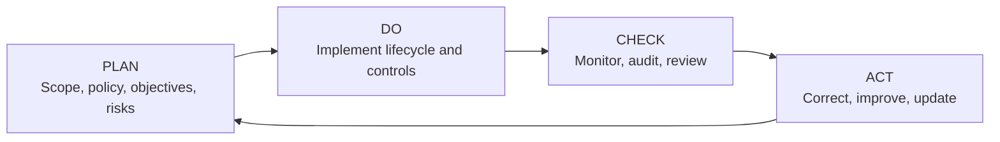
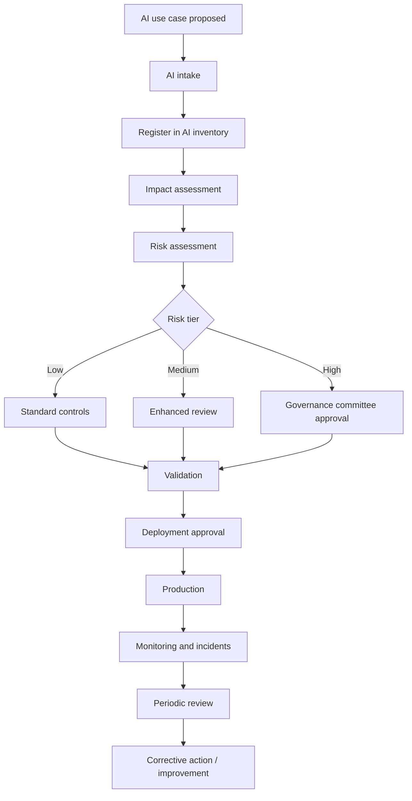

# ISO/IEC 42001 AI Management System Framework

A practical, portfolio-oriented implementation toolkit for designing an Artificial Intelligence Management System (AIMS) aligned with the concepts of ISO/IEC 42001:2023.

> **Important:** This repository is an independent educational and implementation aid. It does not reproduce the ISO/IEC 42001 standard, is not an official ISO publication, and does not guarantee certification or conformity. Organizations should obtain the official standard and professional advice where appropriate.

## Why this repository exists

ISO/IEC 42001 is an international management-system standard for organizations that develop, provide, or use AI systems. It provides a structured approach to governing AI-related risks and opportunities and uses a continual-improvement model. This repository turns those high-level management-system ideas into practical governance artifacts, workflows, templates, and a worked financial-services case study.

## Portfolio objective

This project demonstrates how AI governance can be operationalized across the lifecycle:

**Business need → AI intake → inventory → impact assessment → risk assessment → controls → approval → deployment → monitoring → audit → improvement**

## Core governance questions

Every AI use case should be challenged with the following questions:

1. Who is affected?
2. What harm could occur?
3. What data is being used?
4. Is there bias?
5. Is the decision explainable?
6. Is human review required?
7. Who signs off?
8. What monitoring happens after deployment?

## Repository map

| Area | Purpose |
|---|---|
| `01-context-and-scope` | Define AIMS boundaries, interested parties, and obligations |
| `02-leadership-and-governance` | AI policy, governance charter, roles, RACI |
| `03-ai-inventory` | Register AI systems and intake new use cases |
| `04-risk-management` | Identify, score, treat, and track AI risks |
| `05-ai-impact-assessment` | Evaluate effects on people, groups, and business processes |
| `06-data-governance` | Assess data quality, provenance, privacy, and bias |
| `07-ai-lifecycle` | Design, test, approve, deploy, change, and retire AI systems |
| `08-third-party-ai` | Evaluate AI vendors, suppliers, and external models |
| `09-monitoring` | Monitor drift, performance, incidents, overrides, and harms |
| `10-audit-and-assurance` | Internal audit, evidence, nonconformity, management review |
| `11-controls` | Map risks and obligations to implemented controls and evidence |
| `12-case-study` | Worked example: AI-assisted loan underwriting |
| `diagrams` | Mermaid-based governance and lifecycle diagrams |
| `FACT_CHECK.md` | Verified public ISO facts and boundaries between ISO requirements and this portfolio's example implementation choices |

## AIMS operating model

## AI governance workflow

## Suggested roles

- Executive sponsor / accountable executive
- AI governance lead
- Business owner
- AI system owner
- Model or data-science lead
- Technology owner
- Information security
- Privacy / legal / compliance
- Model risk or independent validation
- Internal audit
- Human-review operations team

## How to use this repository

1. Start with `01-context-and-scope/aims-scope-template.md`.
2. Define governance in `02-leadership-and-governance/`.
3. Register systems using `03-ai-inventory/ai-system-register.csv`.
4. Perform the impact and risk assessments.
5. Select and document controls in `11-controls/control-implementation-matrix.csv`.
6. Use lifecycle gates before production deployment.
7. Monitor performance, incidents, bias, overrides, and drift.
8. Conduct periodic audit and management review.
9. Track corrective actions and continual improvement.

## Featured case study

The `12-case-study/loan-underwriting-ai` folder applies the framework to a hypothetical AI-assisted lending decision system. It demonstrates affected-party analysis, bias risk, explainability, human review, governance sign-off, monitoring, and control design.

## What this demonstrates professionally

This repository is designed to show capability in:

- AI governance
- Responsible AI
- AI risk management
- Technology governance
- Model oversight
- Data governance
- Enterprise architecture
- Control design
- Audit readiness
- Financial-services AI governance

## References

- ISO/IEC 42001:2023 — *Information technology — Artificial intelligence — Management system* — official ISO standard page: https://www.iso.org/standard/42001.html
- ISO, *ISO/IEC 42001 explained*: https://www.iso.org/home/insights-news/resources/iso-42001-explained-what-it-is.html
- ISO/IEC JTC 1/SC 42 catalogue of AI standards: https://committee.iso.org/committee/6794475/x/catalogue/

Use the official ISO publication for authoritative requirements and normative language. The workflows, risk tiers, role names, approval paths, frequencies, templates, and case-study decisions in this repository are example implementation choices; they should not be interpreted as verbatim ISO/IEC 42001 requirements.

## License

MIT License for original repository content. This license does not apply to ISO standards or any third-party copyrighted material.
