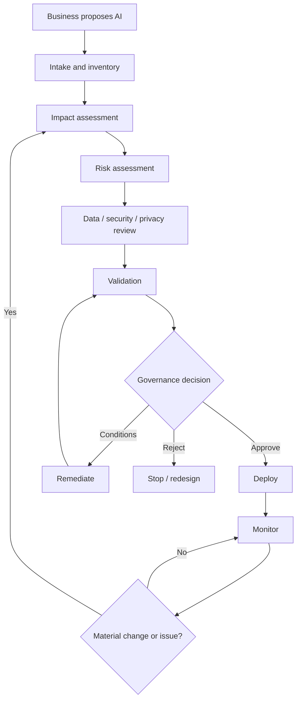

# Governance Flow

```mermaid
flowchart TD
    A[Business proposes AI] --> B[Intake and inventory]
    B --> C[Impact assessment]
    C --> D[Risk assessment]
    D --> E[Data / security / privacy review]
    E --> F[Validation]
    F --> G{Governance decision}
    G -->|Approve| H[Deploy]
    G -->|Conditions| I[Remediate]
    I --> F
    G -->|Reject| J[Stop / redesign]
    H --> K[Monitor]
    K --> L{Material change or issue?}
    L -->|No| K
    L -->|Yes| C
```
